# writing-a-recommendation-api

At a previous workplace, we created a recommendation system as a component of an adaptive learning system for school students.  This descriptive post was never polished enough to go on the technical blog, so here is the draft. 

# Background

The client operates a learning platform for mid to high school students, with more than a million active users and growing. The platform lets them browse video and text content, ask doubts or practice lesson exercises. A big chunk of students use the app for test practice, which amounts to as much as half of the total engagement. We want to improve this experience. 

Students pick a specific lesson they want to work through and the platform recommends questions for them to solve one after the other. Picking questions at random doesn’t work well since,

- The catalog of questions for any selected lesson is huge, with widely varying difficulty levels and a lot of similarities. We want to optimize students' learning by helping them progress gradually.
- A sequence of problems that are all too easy, or too difficult make the student zone out and leave the session. Practice is good, we want them to stick around longer.

We conjecture that adapting the exercise experience for each student based on their prior history can increase both engagement and learning outcomes. To solve it, we designed an adaptive question recommendation system - given a user and a list of questions to choose from, it suggests the ones that they should attempt next. The API specification is general enough and deployed as a separate service so

- We could extend into a personalized content recommendation system - plug it into learning content to draw lesson plans, make customized tests, suggest areas of improvement for a student, and more.
- We are not tied in to the platform’s content system which is always in flux. This lets us experiment with recommendation models quickly, and possibly make use of more contextual information for a student.

# Recommendation system

We implement a web API in python that the main platform backend calls repeatedly as a student works through the exercise session. The time budget to generate suggestions is limited considering it is not on device, so we aim to keep the average latency around 100 ms. The lifecycle of a single request can be split into three components, developed with little coupling.

1. **Fetching data**
    - Pull the list of questions to select from, plus all the relevant user history and context.
    - We decided on using a Postgres database for the backend, backed by a Redis cache, which has served us well.
2. **Recommendation model**
    - Compute/provide enough information to evaluate how likely the user is to solve each question.
    - We train a collaborative filter model on the data of all the previous student attempts, and make partial updates to it during a session.
3. **Recommendation strategy**
    - Use the model output and possibly more contextual data for the user to generate the final output.
    - We converged on the policy of suggesting questions where the probability of students solving it correctly is close to 50 pc, with fallbacks.

We go over these one at a time.

## Fetching data

The input API request from platform's backend specifies the active user and the content we need to select the questions from. We store all the relevant information needed in a separate datastore managed by us and don't make any other API calls.

- **Content**
The platform has multiple ways to organize the learning content based on how it is being served to the student. The standard way is to start from the school curriculum (a lot of variance across the country), then segment it successively by the grade, subject, chapters and sections. Another approach is to plan around specific learning outcomes for the student, organizing lessons/questions by teaching units and goals that can span subjects or school levels.
    
    To stay agnostic to the content hierarchy, we introduced a construct called `Question unit`, which covers all the ways to group questions. Each question unit either maps to a list of questions directly (section -> question) or recursively (chapter -> section, section -> question). We query the platform's content database everyday to fetch the current set of question unit relationships and save it to our datastore. When serving the API, the request lists a set of question units to recommend from, which we resolve to a list of questions.
    
- **User history**
To provide an adaptive experience, we want to track how the student performed interacted with the content previously and in the current session. Hence, we record all the student question attempts on the Toppr platform. Each attempt is identified by the user who made it and the question attempted, with other attributes - the user response, time spent on it, if it was correct, etc.
    
    Based on the request parameters, we filter the set of relevant attempts to that required by the recommendation model.
    

We experimented with a bunch of different storage choices and data models before selecting Postgres.

- **In-memory**
In an earlier iteration, the recommender was written in Dlang, with all the user history and content data held in memory as key value pairs. However, it was not extensible and as the usage grew, it could only be scaled vertically and suffered from longer garbage collection pauses.
- **Redis**
When refactoring the system, we tried to use Redis which offered some useful data structures. However, modeling the content data (which has a tree structure) required some ingenuity, while the user attempt history which was much bigger needed duplication to make querying efficient.
- **Postgres**
The relational model was easy to adapt for content data since the question unit hierarchy could be represented as a graph, and SQL makes it easy to query over it. The user attempt history also has a consistent schema, and creating indexes over both user and question ids lets us slice it it conveniently, including constraints from the content relations. Since these queries can get expensive, we also use a small redis service to cache results which can be incrementally updated.
    
    We opted for the managed database service by the cloud provider so there have been no operational hiccups. Postgres has scaled well for our requirements, and our data model will allow us to shard the attempts history data when query performance degrades.
    

## ML model

The objective here is to score each of the questions available for the user to attempt. We model the score as probability of the user getting the question correct.

### Input data

To make a prediction for each student-question pair, we have to select relevant data to feed in. Right now, we use the previous attempts made by users on the platform. The attempts history is useful since it indicates

- How other users fared on the same question
- How the current user performed on similar questions
- How a similar user performed on a similar question... you get the idea.

Parsing through all the attempts ever made would take forever, so we want to work with only a subset of the attempt logs for each student-question pair. We introduce the constraint that this *filter* can only be specified as a set of question units. In pseudo code,

```
filter_mapping: question -> list[QuestionUnit]

def filter(attempts, question):
	select * from attempts
	where question_id in (
		question_id
		for unit in filter_mapping[question]
		for question_id in unit
	)
```

An important thing to note here is that the set of questions in the API request could be different than the set of questions the model learns from. The same question could come up in different contexts, and we would still score it the same way for a user. This allows us flexibility in training the recommendation model, like for questions belonging to a new concept with little history available, we could train the model over all attempts made in the full chapter. While there are some sections with already a big selection of questions for the model learn from, we might want to prune available attempt logs.

This setup is flexible enough for us right now, though we might want to tweak it in the future. For example - we might only want to use attempts made in the last year for inference, or only group users studying the same curriculum together, and so forth.

### Model training

We want to train a model that adapts as a student progresses through a concept.

### Real time prediction

Going from attempt logs to computing the probability of a user solving a question is still not very tractable. For instance, a chapter typically has multiple thousand questions, while each question has been attempted by tens of thousands of users earlier. For a single API request, this would mean processing around a million attempts.

### Learn periodically?

To get around this, one option is to train the ML model periodically, say every morning and cache the results to use through the day. However, this puts us at odds with making the learning experience adaptive. For instance, if the student has solved three consecutive physics problems about pulleys and blocks, you want to challenge them by asking something like - `what about the same problem but now a monkey is pulling down the rope at one of the ends and the pulley is inside a spaceship leaving earth at one tenth the speed of light`?.

This is to say, to keep the student engaged, the model output must adjust in real time as the platform learns more about them.

### Compromise

After some iterations, we converged on using models of a certain form, specifically *Embedding models*.  Treating attempts as interactions between students and questions, the signature for such a model is given as,

```
Embedding model
* train input: interactions between M users x N items
* train output: (M + N) outputs, one for each user and each item
* inference for pair (user A, item B): f(output-A, output-B)

```

Embedding models produce output of *linear* (M + N) size compared to the general case where it'd be *quadratic* (M x N). To be clear, the output for each student-question pair will still be unique, this just imposes some structure on it. The model output is labeled as `user-embeddings` and `question-embeddings`, respectively. This allows us to balance caching some of the model output and making real time updates to the prediction in an interesting way.

Consider students attempting the chapter on `Kinematics`, and an embedding model trained on the corresponding attempt history. The relevant attempt logs for predicting student-A performance on question-B from the chapter can be split into three sets

1. performance of student A in this chapter
2. performance of all other students on question B

There is a clear bias in that questions are persistent while the users are not. We conjecture that once question-B has accumulated considerable history, each additional student attempt should affect the embedding for B only a little. However, as student A works through this chapter, the embedding for A should evolve rapidly.  Thus, while the information content in set-2 is stable, that in set-1 changes during a user session and our model needs to adapt to it.

### Model workflow

Armed with this assumption, we posit that the question embeddings can be learnt periodically while the user embeddings are evaluated live. The full sequence of steps for any given question unit is: 

- The system wakes up each morning and queries all attempts made in that unit.
- Full training: T=train an embedding model for all questions and users involved in the attempt history.
- Store the question embeddings, and throw away those for the user.

When a recommendation request shows up for a student working on the unit,
- Fetch the full attempt history for the unit, and embeddings for all the candidate questions. Note the attempt logs would have grown as the user progresses through the unit.
- For each candidate question, the score for the student-question pair can now be evaluated.

The embedding model setup ensures that incremental training is inexpensive and can be done in real time, while approximating the output of a full training fairly well. By making a full train more frequent that once every 24h, we can further ensure that the deviation is minimal. This lets us capture the student progress during the day neatly.

## Recommendation strategy

This component uses the student-question scores computed from the ML model and selects which one to recommend. We experimented with different policies through running A/B tests and assessing the impact on student engagement. However, gathering feedback from students as well as content creators working for the platform, turned out to be more useful and indicated a clear preference for exercises that are in the mid difficulty range.

The strategy module also allows us to do more things without tweaking the rest of the response pipeline.

- If the network latency is high, the API response can be a batch of questions instead of one at a time.
- The recommendation policy could evaluate scores from multiple ML models before selecting a question. We use this to A/B test hyperparameters for the embedding model.
- The adaptive system was extended to compile a set of take-home problems for students, and email nudges when they log in infrequently.

# System diagram

The recommendation system lives across three process boundaries.

- Postgres server
- API server
- Model training



# Other considerations

- **Creating a session corresponding to each user session and making recommendations in that context.**

    This would allow for richer interaction models - how long the student is into the current session, whether they are jumping around concepts or working through just one, etc. However, this introduces coupling with the clients' platform and harder to experiment with recommendation models. Further, a stateless API proved easier to scale horizontally as both the num of users, and num of requests per user grew.

- **Is the model well calibrated?**

    Yes. We evaluate our predictions for a student solving a question vs how they actually fared each day. We bucket predictions by probability of success into segments (30-40 pc, 40-50 pc, ...) and evaluate the percent of correct responses in each bucket. Besides the tail regions, they coincide reasonably well.

- **More complex modeling**
    
    We continue to experiment with feedforward and recurrent neural network models but so far haven't seen enough improvement in prediction accuracy to warrant switching to them. Collaborative filter models we use right now accommodate new users and questions nicely, and the model predictions have also been reasonable. We believe the recommendation policy is a more important lever to improve outcomes at present.

- **Postgres as relational database**
    
    We did empirical testing with both Postgres and MySQL database servers on similarly powered machines. MySQL query performance was somewhat better even for test size datasets, however Postgres offered smaller variance and a better python adapter library in `psycopg2` (we did not use ORMs since one object for each data row is wasteful when doing data analysis).